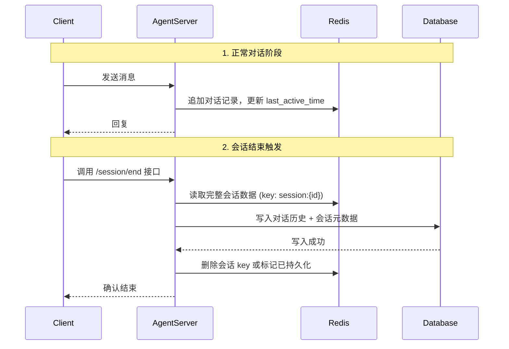

## 一、如何检测“会话结束”

在 Agent 应用中，会话结束通常由以下几种情况触发：

| 触发方式           | 检测手段                                                     | 适用场景           |
| ------------------ | ------------------------------------------------------------ | ------------------ |
| **用户主动结束**   | 前端调用 `session.end` 接口，或点击“退出/关闭”按钮           | Web / App 聊天界面 |
| **页面关闭/刷新**  | 监听浏览器的 `beforeunload` 或 `visibilitychange` 事件       | Web 应用           |
| **WebSocket 断开** | 服务端检测到 WebSocket 连接关闭事件                          | 实时对话应用       |
| **会话超时**       | 服务端定时扫描 Redis 中会话的 `last_active_time`，超过阈值则视为结束 | 通用兜底方案       |
| **Agent 任务完成** | 业务逻辑明确结束（如工单关闭、交易完成）                     | 工作流型 Agent     |

**推荐组合**：**前端主动通知 + 后端超时兜底**，确保任何情况下最终都能持久化。

---

## 二、核心实现流程



---

## 三、具体实现（含代码示例）

以 Python + FastAPI + Redis + PostgreSQL 为例。

### 1. 数据结构设计

**Redis 存储结构**（Hash）：
```
session:{session_id}  ->  {
    "session_id": "xxx",
    "user_id": "123",
    "start_time": "2026-01-01T10:00:00Z",
    "last_active_time": "2026-01-01T10:05:30Z",
    "status": "active",          // active / ended
    "messages": "[{...},{...}]"  // JSON 字符串存储消息列表
}
```

**数据库表**（简化）：
```sql
CREATE TABLE conversation_history (
    id SERIAL PRIMARY KEY,
    session_id VARCHAR(64) NOT NULL,
    user_id VARCHAR(64),
    start_time TIMESTAMP,
    end_time TIMESTAMP,
    messages JSONB,               -- 完整对话记录
    created_at TIMESTAMP DEFAULT NOW()
);
```

### 2. 后端实现

#### (1) 对话过程中实时更新 Redis

```python
import json
import time
from fastapi import FastAPI, Request
from redis import Redis
from datetime import datetime

app = FastAPI()
redis_client = Redis(host="localhost", decode_responses=True)

# 每次收到用户消息时调用
async def update_conversation(session_id: str, user_message: str, agent_reply: str):
    # 构造新消息
    new_entry = {
        "role": "user",
        "content": user_message,
        "timestamp": datetime.utcnow().isoformat()
    }, {
        "role": "assistant",
        "content": agent_reply,
        "timestamp": datetime.utcnow().isoformat()
    }

    # 获取现有会话数据
    session_key = f"session:{session_id}"
    existing = redis_client.hget(session_key, "messages")
    messages = json.loads(existing) if existing else []

    messages.extend([new_entry[0], new_entry[1]])

    # 写回 Redis，同时更新最后活跃时间
    redis_client.hset(session_key, mapping={
        "messages": json.dumps(messages),
        "last_active_time": datetime.utcnow().isoformat()
    })
    # 设置 TTL 防止孤儿会话（比如 1 小时）
    redis_client.expire(session_key, 3600)
```

#### (2) 会话结束写入数据库

**方式一：前端主动调用结束接口**

```python
@app.post("/session/end/{session_id}")
async def end_session(session_id: str):
    session_key = f"session:{session_id}"
    
    # 1. 从 Redis 读取完整会话数据
    session_data = redis_client.hgetall(session_key)
    if not session_data:
        raise HTTPException(404, "Session not found")
    
    # 2. 写入数据库
    async with db_pool.acquire() as conn:
        await conn.execute("""
            INSERT INTO conversation_history 
            (session_id, user_id, start_time, end_time, messages)
            VALUES ($1, $2, $3, $4, $5)
        """, session_data["session_id"], session_data.get("user_id"),
            session_data.get("start_time"), datetime.utcnow().isoformat(),
            session_data["messages"])
    
    # 3. 删除 Redis 中的会话数据（或仅标记为已持久化）
    redis_client.delete(session_key)
    
    return {"status": "ended"}
```

**方式二：会话超时扫描（后台任务）**

```python
import asyncio
from datetime import datetime, timedelta

async def scan_timeout_sessions():
    while True:
        await asyncio.sleep(60)  # 每分钟扫描一次
        now = datetime.utcnow()
        # 使用 Redis SCAN 匹配所有 session:* 键
        for key in redis_client.scan_iter("session:*"):
            session_data = redis_client.hgetall(key)
            last_active = datetime.fromisoformat(session_data["last_active_time"])
            if now - last_active > timedelta(minutes=30):  # 30分钟无活动视为结束
                # 调用持久化逻辑（与 end_session 相同）
                await persist_session(key.split(":")[1], session_data)
                redis_client.delete(key)

# 在启动时运行后台任务
@app.on_event("startup")
async def start_scheduler():
    asyncio.create_task(scan_timeout_sessions())
```

#### (3) 前端监听页面关闭事件（保险）

```javascript
// 在用户打开聊天页面时注册
window.addEventListener('beforeunload', () => {
    // 使用 sendBeacon 确保请求在页面关闭前发出
    navigator.sendBeacon('/api/session/end/' + sessionId);
});
```

---

## 四、注意事项与优化

1. **数据一致性**  
   - 写入数据库后应**立即删除 Redis 中的对应 key**，避免后续超时扫描重复写入。
   - 如果写入数据库失败，不要删除 Redis，可记录错误日志并依赖超时扫描重试。

2. **TTL 设置**  
   - 为 Redis 会话 key 设置合理的 TTL（如 2 小时），即使所有持久化机制都失败，Redis 也能自动回收内存。

3. **并发问题**  
   - 如果用户在持久化过程中又发送了新消息，怎么办？  
     解决方案：在 `end_session` 接口开始时，先将 Redis 中的 `status` 改为 `"ending"`，拒绝后续消息更新；或使用 Redis 分布式锁。

4. **性能优化**  
   - 如果单次会话消息量很大（超过 1MB），建议将 `messages` 拆分为多个 Redis List 或使用分块存储，避免大 Key 阻塞。
   - 数据库写入可改为异步队列（如 Celery），避免阻塞 HTTP 响应。

5. **降级方案**  
   - 当数据库写入失败时，可将会话数据转存到本地文件或备份 Redis，并发送告警。

---

## 五、总结：实现 Checklist

- [ ] 确定会话结束检测方式（前端通知 + 后端超时）
- [ ] 设计 Redis 存储结构（Hash 或 String JSON）
- [ ] 实现每次交互更新 Redis 并刷新 TTL
- [ ] 实现 `POST /session/end` 接口（读取 Redis → 写 DB → 删 Redis）
- [ ] 实现后台超时扫描任务
- [ ] 前端监听页面关闭事件发送 `sendBeacon`
- [ ] 设置合理的 Redis TTL 作为最终兜底
- [ ] 添加失败重试和监控告警

按照这个流程，你可以稳定地实现“会话结束时写入”，兼顾性能与数据持久化。