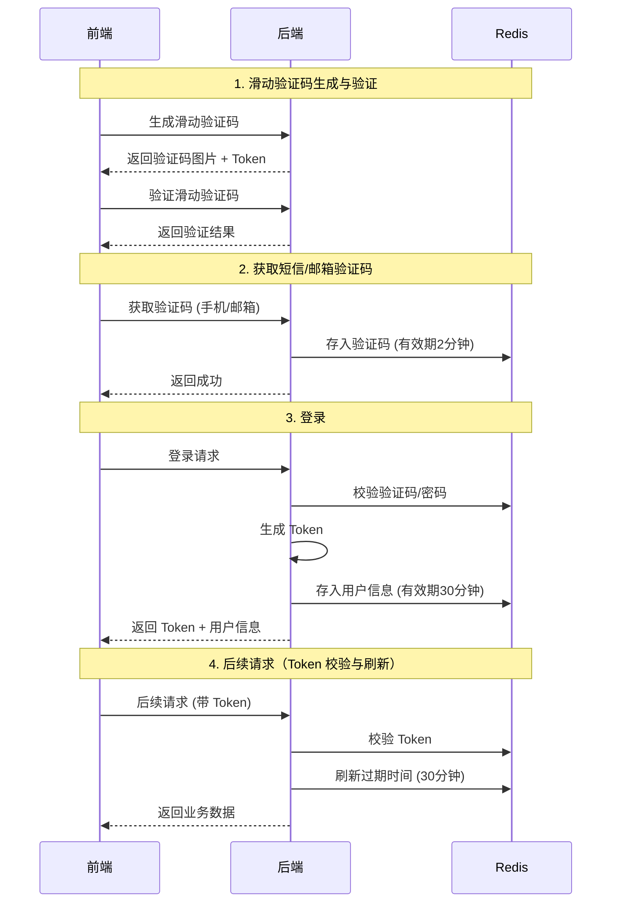
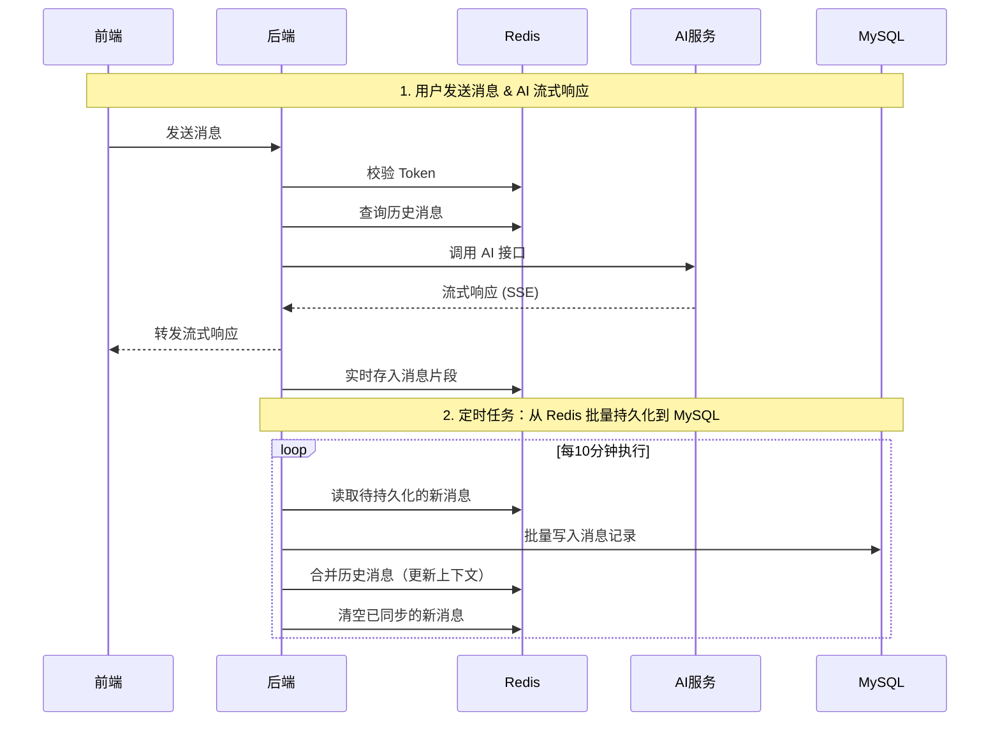

# Code Mind Agent Server 项目文档

## 目录

1. [项目概览](#1-项目概览)
2. [技术架构](#2-技术架构)
3. [项目结构](#3-项目结构)
4. [数据库设计](#4-数据库设计)
5. [核心业务流程](#5-核心业务流程)
6. [缓存策略](#6-缓存策略)
7. [API 接口说明](#7-api-接口说明)
8. [安全机制](#8-安全机制)
9. [配置说明](#9-配置说明)
10. [快速开始](#10-快速开始)
11. [监控与运维](#11-监控与运维)

---

## 1. 项目概览

### 1.1 项目简介

**Code Mind Agent Server** 是一个 AI 智能对话代理后端服务，提供流式/非流式聊天、会话管理、用户认证等功能。该服务作为 AI 引擎与前端应用之间的桥梁，负责处理用户请求、管理会话状态、持久化聊天记录等核心业务。

### 1.2 核心特性

- **双模式聊天**：支持流式（SSE）和非流式两种聊天方式
- **会话管理**：完整的会话生命周期管理，支持创建、归档、删除
- **多方式登录**：支持手机验证码、账号密码、邮箱验证码三种登录方式
- **高性能架构**：Redis 缓存 + 定时持久化，兼顾性能与数据安全
- **安全防护**：RSA 加密、密码加盐、滑动验证码、Token 认证多层防护
- **响应式编程**：Spring WebFlux 实现非阻塞流式响应

### 1.3 项目定位

- **后端服务**：Spring Boot 3.x RESTful API
- **AI 代理**：封装与 Python AI 服务的通信
- **会话中心**：管理用户会话和聊天历史
- **认证中心**：用户注册、登录、权限验证

---

## 2. 技术架构

### 2.1 技术栈

| 技术组件 | 版本 | 用途 |
|---------|------|-----|
| Spring Boot | 3.2.5 | 核心应用框架 |
| Spring Web | 3.2.5 | 传统 REST API |
| Spring WebFlux | 3.2.5 | 响应式流式聊天 |
| MyBatis Plus | 3.5.14 | ORM 持久层 |
| MySQL | - | 关系型数据库 |
| Redis | - | 缓存、会话存储 |
| Hutool | 5.8.16 | Java 工具库 |
| Lombok | - | 代码简化 |
| 天爱验证码 | 1.5.5 | 滑动验证码 |

### 2.2 架构设计

```
┌─────────────────────────────────────────────────────────────┐
│                        前端应用                              │
└─────────────────────────┬───────────────────────────────────┘
                          │
                          ▼
┌─────────────────────────────────────────────────────────────┐
│              Spring Boot 3.x 后端服务                        │
│  ┌─────────────────────────────────────────────────────┐   │
│  │  Controller Layer (控制器层)                         │   │
│  │  - ChatController (聊天)                            │   │
│  │  - SessionController (会话)                         │   │
│  │  - UserController (用户)                            │   │
│  │  - CaptchaController (验证码)                       │   │
│  └─────────────────────┬───────────────────────────────┘   │
│                        │                                   │   │
│  ┌─────────────────────▼───────────────────────────────┐   │
│  │  Service Layer (服务层)                              │   │
│  │  - ChatService (聊天核心)                           │   │
│  │  - SessionsService (会话管理)                       │   │
│  │  - MessagesService (消息管理)                       │   │
│  │  - UserService (用户认证)                           │   │
│  └─────────────────────┬───────────────────────────────┘   │
│                        │                                   │   │
│        ┌───────────────┴───────────────┐                  │   │
│        ▼                               ▼                  │   │
│  ┌───────────────┐            ┌─────────────────┐         │   │
│  │     Redis     │            │     MySQL       │         │   │
│  │  (缓存层)     │            │   (持久层)      │         │   │
│  └───────────────┘            └─────────────────┘         │   │
└─────────────────────────┬───────────────────────────────────┘
                          │
                          ▼
              ┌─────────────────────┐
              │  Python AI 服务     │
              │  (端口 8000)        │
              └─────────────────────┘
```

### 2.3 混合架构说明

项目采用 **Spring MVC + Spring WebFlux 混合架构**：

- **Spring MVC**：处理用户认证、会话管理等传统同步请求
- **Spring WebFlux**：处理流式聊天，利用响应式背压实现高性能

---

## 3. 项目结构

### 3.1 目录树

```
code-mind-agent-server/
├── src/
│   ├── main/
│   │   ├── java/com/itsnow/
│   │   │   ├── CodeMindAgentServerApplication.java    # 主启动类
│   │   │   ├── config/                                 # 配置类
│   │   │   │   ├── WebCorsConfiguration.java           # CORS + 拦截器
│   │   │   │   ├── WebClientConfiguration.java         # WebClient 配置
│   │   │   │   ├── CaptchaResourceConfiguration.java   # 验证码配置
│   │   │   │   └── RSAProperties.java                  # RSA 密钥配置
│   │   │   ├── controller/                             # 控制层
│   │   │   │   ├── ChatController.java
│   │   │   │   ├── SessionController.java
│   │   │   │   ├── UserController.java
│   │   │   │   ├── CaptchaController.java
│   │   │   │   └── HealthController.java
│   │   │   ├── service/                                # 服务层
│   │   │   │   ├── ChatService.java
│   │   │   │   ├── UserService.java
│   │   │   │   ├── SessionsService.java
│   │   │   │   ├── MessagesService.java
│   │   │   │   └── impl/
│   │   │   ├── mapper/                                 # MyBatis Plus Mapper
│   │   │   ├── domain/
│   │   │   │   ├── pojo/                               # 实体类
│   │   │   │   ├── vo/                                 # 视图对象
│   │   │   │   └── dto/                                # 数据传输对象
│   │   │   ├── enums/                                  # 枚举
│   │   │   ├── exception/                              # 异常类
│   │   │   ├── interceptor/                            # 拦截器
│   │   │   ├── handle/                                 # 异常处理
│   │   │   ├── task/                                   # 定时任务
│   │   │   ├── utils/                                  # 工具类
│   │   │   └── constant/                               # 常量
│   │   └── resources/
│   │       ├── application.yaml                        # 主配置
│   │       ├── application-dev.yaml                    # 开发配置
│   │       ├── docs/                                   # 文档目录
│   │       ├── bgimages/                               # 验证码背景图
│   │       └── com/itsnow/mapper/                      # MyBatis XML
│   └── test/
├── pom.xml
└── README.md
```

### 3.2 核心模块说明

| 模块 | 说明 |
|-----|------|
| controller | 定义 REST API 接口，处理 HTTP 请求 |
| service | 业务逻辑层，实现核心功能 |
| mapper | 数据访问层，MyBatis Plus 接口 |
| domain | 数据模型（POJO、VO、DTO） |
| exception | 自定义异常类 |
| interceptor | 请求拦截器（登录校验、Token 刷新） |
| task | 定时任务（消息持久化） |
| utils | 工具类（RSA、密码加密、正则等） |
| config | Spring 配置类 |

---

## 4. 数据库设计

### 4.1 用户表 (user)

| 字段 | 类型 | 允许 NULL | 说明 |
|-----|------|----------|------|
| id | BIGINT | NO | 主键，自增 |
| username | VARCHAR(50) | NO | 登录账号，唯一 |
| phone | VARCHAR(20) | YES | 手机号 |
| password | VARCHAR(255) | NO | 加密密码 |
| email | VARCHAR(100) | YES | 邮箱 |
| enabled | TINYINT | NO | 是否启用 (1:启用 0:禁用) |
| created_at | DATETIME | NO | 创建时间 |
| updated_at | DATETIME | NO | 更新时间 |

### 4.2 会话表 (sessions)

| 字段 | 类型 | 允许 NULL | 说明 |
|-----|------|----------|------|
| id | BIGINT | NO | 主键 |
| user_id | BIGINT | NO | 用户 ID |
| repo_id | INT | YES | 关联仓库 ID |
| title | VARCHAR(255) | YES | 会话标题 |
| status | TINYINT | NO | 状态 (0:活跃 1:已归档 2:已删除) |
| created_time | DATETIME | NO | 创建时间 |
| updated_time | DATETIME | NO | 最后活动时间 |

### 4.3 消息表 (messages)

| 字段 | 类型 | 允许 NULL | 说明 |
|-----|------|----------|------|
| id | BIGINT | NO | 主键，自增 |
| session_id | BIGINT | NO | 所属会话 ID |
| role | TINYINT | NO | 角色 (0:SYSTEM 1:USER 2:ASSISTANT 3:TOOL) |
| content | TEXT | YES | 消息内容（JSON 格式） |
| created_at | DATETIME | NO | 创建时间 |

---

## 5. 核心业务流程

### 5.1 用户认证流程

#### 5.1.1 登录方式

项目支持三种登录方式：

1. **手机验证码登录**
2. **账号密码登录**（支持账号/邮箱/手机号）
3. **邮箱验证码登录**

#### 5.1.2 认证时序



### 5.2 聊天流程（流式）



### 5.3 会话管理流程

```
创建会话 → 发送消息 → 更新最后活动时间 → 结束会话/定时持久化
     ↓
历史消息查询：Redis 优先 → 降级到 MySQL
```

---

## 6. 缓存策略

### 6.1 Redis Key 设计

| Key 模式 | 类型 | 说明 | TTL |
|---------|-----|-----|-----|
| `login:code:{phone/email}` | String | 登录验证码 | 2 分钟 |
| `login:token:{token}` | Hash | 用户登录信息 | 30 分钟 |
| `session:{sessionId}` | Hash | 会话消息缓存 | 见下文 |
| `session:index` | Set | 需要持久化的会话索引 | 永久 |

### 6.2 会话缓存结构 (`session:{sessionId}`)

```
{
  "history": "[{...已持久化的历史消息...}]",
  "messages": "[{...未持久化的新消息...}]",
  "last_activate_time": "2026-04-25T10:30:00"
}
```

### 6.3 缓存持久化策略

**核心机制**：

1. **实时缓存**：消息先写入 Redis，不直接写库
2. **会话活跃状态**：
   - 会话活跃时，Redis Key **无过期时间**
   - 调用 `/session/end/{sessionId}` 后，设置 60 分钟过期
3. **定时持久化**：
   - 每 1 分钟扫描 `session:index`
   - 将未持久化的消息批量写入 MySQL
   - 写入成功后，合并 `history`、清空 `messages`

详细文档请参考：[缓存持久化策略.md](./缓存持久化策略.md)

---

## 7. API 接口说明

### 7.1 健康检查

| 方法 | 路径 | 说明 |
|-----|------|------|
| GET | `/health` | 检查服务健康状态 |

### 7.2 聊天接口

| 方法 | 路径 | 说明 |
|-----|------|------|
| POST | `/chat` | 非流式聊天 |
| POST | `/chat/stream` | 流式聊天 (SSE) |
| GET | `/chat/history` | 获取会话历史消息 |

### 7.3 会话管理

| 方法 | 路径 | 说明 |
|-----|------|------|
| GET | `/session` | 获取用户会话列表 |
| POST | `/session` | 创建新会话 |
| PUT | `/session/{id}` | 归档会话 |
| DELETE | `/session/{id}` | 逻辑删除会话 |
| POST | `/session/end/{sessionId}` | 结束会话（触发持久化） |

### 7.4 验证码

| 方法 | 路径 | 说明 |
|-----|------|------|
| POST | `/genCaptcha` | 生成滑动验证码 |
| POST | `/check` | 校验验证码 |

### 7.5 用户认证

| 方法 | 路径 | 说明 |
|-----|------|------|
| POST | `/user/login` | 用户登录 |
| POST | `/user/regist` | 用户注册 |
| POST | `/user/code` | 发送手机验证码 |
| POST | `/user/emailCode` | 发送邮箱验证码 |
| GET | `/user/info` | 获取当前用户信息 |

详细接口文档请参考：[API文档.md](./API文档.md)

---

## 8. 安全机制

### 8.1 RSA 加密传输

- 密码使用 RSA 非对称加密传输
- 公钥配置在 `rsa.public-key`，私钥配置在 `rsa.private-key`

### 8.2 密码加盐存储

采用 Spring Security 风格的密码加密：
- 随机盐值
- 慢哈希算法
- 验证时自动匹配盐值

### 8.3 滑动验证码

- 防止暴力破解和恶意注册
- 验证码 Token 有效期：60 秒

### 8.4 Token 认证

- Token 存入 Redis，有效期 30 分钟
- 每次请求自动刷新过期时间
- 用户信息通过 `UserHolder` 上下文获取

### 8.5 授权检查

- 敏感接口校验用户是否为会话所有者
- 防止越权访问他人会话

---

## 9. 配置说明

### 9.1 application.yaml

```yaml
spring:
  datasource:
    url: jdbc:mysql://localhost:3306/code_mind_agent
    username: root
    password: 1234
    driver-class-name: com.mysql.cj.jdbc.Driver

  data:
    redis:
      host: 127.0.0.1
      port: 6379
      database: 0
      lettuce:
        pool:
          max-active: 8
          max-idle: 8
          min-idle: 0

mybatis-plus:
  configuration:
    map-underscore-to-camel-case: true
    log-impl: org.apache.ibatis.logging.stdout.StdOutImpl
  global-config:
    db-config:
      id-type: auto

rsa:
  public-key: ...
  private-key: ...

captcha:
  prefix: captcha:slider
  expire:
    default: 60000

ai:
  service:
    url: http://localhost:8000
```

### 9.2 多环境配置

- `application.yaml`：主配置文件
- `application-dev.yaml`：开发环境配置

---

## 10. 快速开始

### 10.1 环境要求

- JDK 17+
- MySQL 8.0+
- Redis 6.0+
- Python 3.9+ (AI 服务)

### 10.2 启动步骤

1. **启动 MySQL**
   ```sql
   CREATE DATABASE code_mind_agent CHARACTER SET utf8mb4;
   ```

2. **启动 Redis**
   ```bash
   redis-server
   ```

3. **启动 Python AI 服务**
   ```bash
   # 进入 AI 服务目录
   python main.py  # 默认端口 8000
   ```

4. **修改配置**
   - 修改 `src/main/resources/application.yaml` 中的数据库和 Redis 连接信息

5. **启动后端服务**
   ```bash
   mvn spring-boot:run
   ```

6. **验证服务**
   访问 `http://localhost:8080/health`

---

## 11. 监控与运维

### 11.1 日志配置

- MyBatis SQL 日志：`StdOutImpl`（开发环境）
- 建议生产环境配置日志文件和日志级别

### 11.2 关键监控指标

- Redis 内存使用率
- MySQL 连接池状态
- AI 服务响应时间
- 消息持久化队列长度

### 11.3 数据备份

- MySQL 定期备份
- Redis 持久化策略：RDB + AOF

---

## 附录

### 相关文档

- [API文档.md](./API文档.md) - 详细接口文档
- [缓存持久化策略.md](./缓存持久化策略.md) - 缓存策略详解
- [缓存持久化策略时序图.png](./缓存持久化策略时序图.png) - 时序图

### 联系方式

- 项目地址：[GitHub Repository]
- 问题反馈：[Issue Tracker]